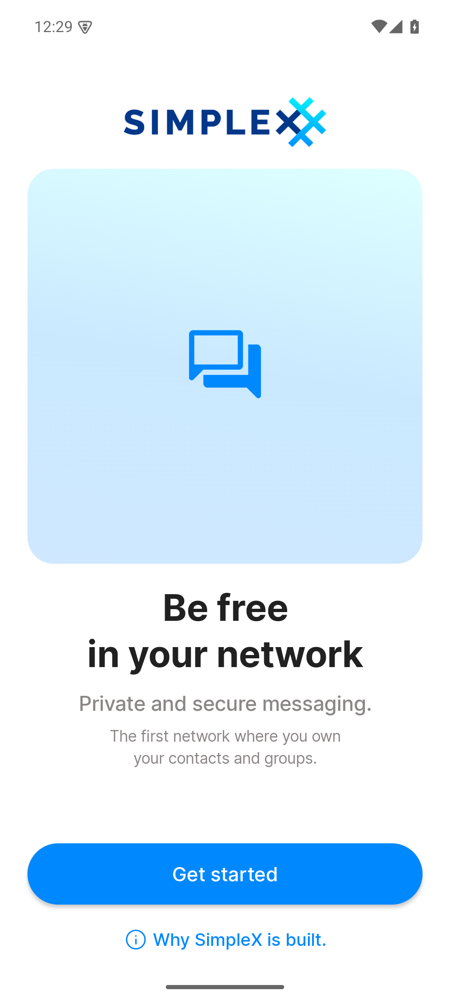
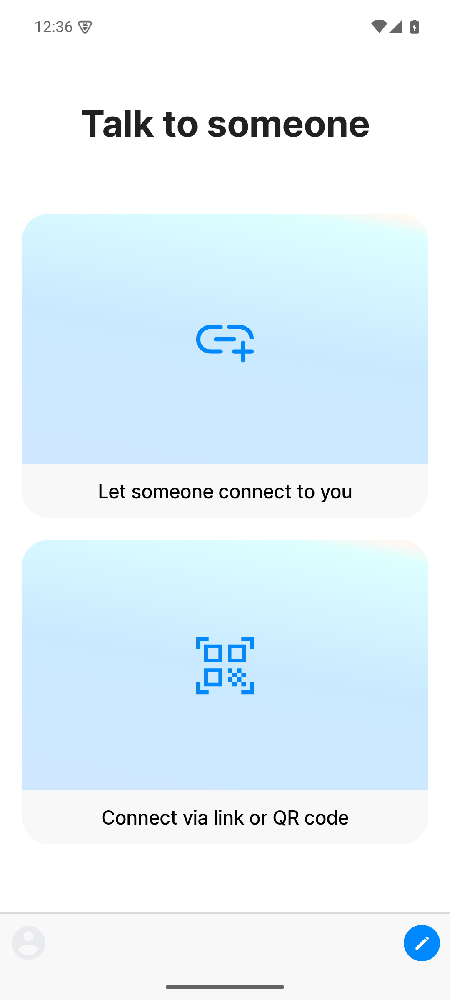
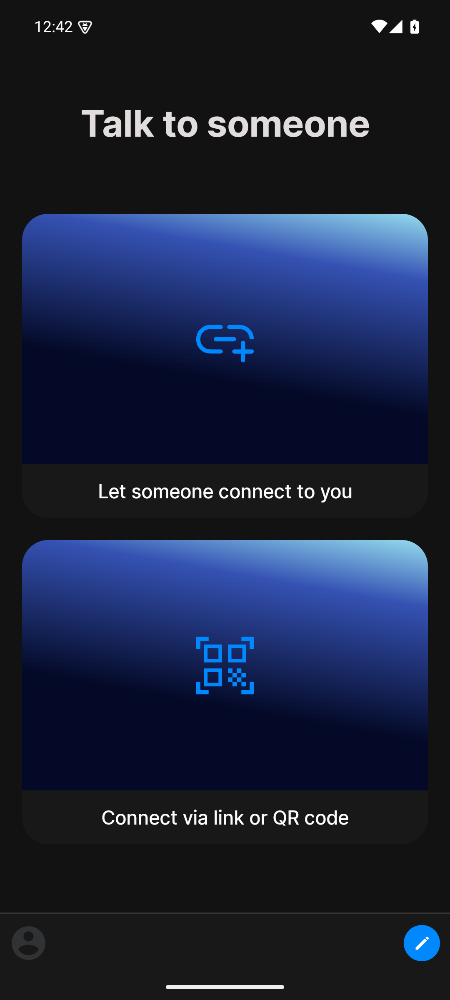
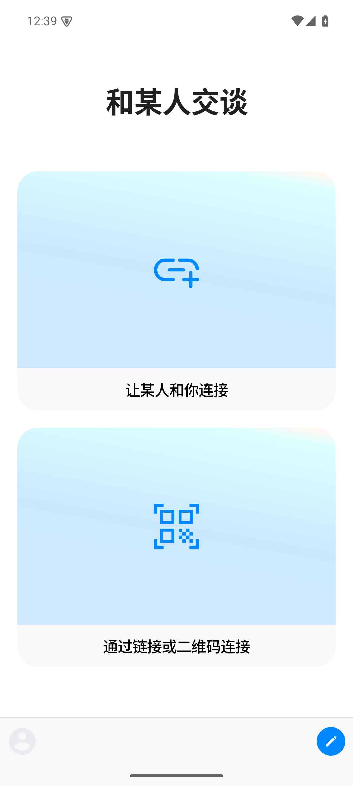
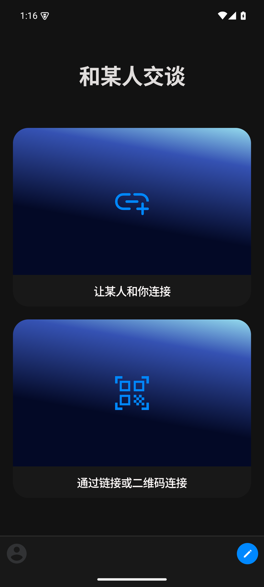

# Native screenshot comparison — official v6.5.6 baseline

This is the required Android-native **before** comparison for Phase 1. It does not claim that the approved Nome UI is implemented. The native captures are from the isolated package `chat.simplex.app.nome.dev` on the API 35 emulator; the references are the frozen approved Android effects.

## P03 welcome — English / light

| Approved Nome Android reference | Native official v6.5.6 baseline |
|---|---|
|  |  |

Recorded differences: the baseline retains SimpleX branding, upstream illustration, upstream typography, and upstream action hierarchy. The approved reference is Nome-branded and uses the frozen Nome shell/tokens. This expected mismatch confirms that no historical Nome UI was silently present.

## P08 empty home — English / light

| Approved Nome Android reference | Native official v6.5.6 baseline |
|---|---|
|  |  |

Recorded differences: the baseline uses the upstream “Talk to someone” cards, gradients, bottom controls, and spacing. The approved reference defines the Nome empty/loading hierarchy and tokens. The real empty-user state is preserved as upgrade evidence, not treated as a visual pass.

## Baseline language and theme quadrants

| English / light | English / dark |
|---|---|
|  |  |

| Simplified Chinese / light | Simplified Chinese / dark |
|---|---|
|  |  |

The Chinese dark capture was repeated after a full force-stop and cold app start with `AppLanguage=zh-CN`. Its UIAutomator tree contains `返回`, `资料图片占位符`, and `开始新聊天`; the earlier mixed-language tree was replaced and is not counted as passing evidence.

## Comparison boundary

- Native device output is 1080 × 2400 pixels; the approved PNG is a 470 × 936 framed design asset, so Phase 1 records semantic/layout differences rather than a false pixel-perfect score.
- `FLAG_SECURE` was left at the official default for the first black capture. It was disabled only in the isolated runtime preference for the subsequent evidence captures; source and APK bytes were not changed.
- Nome implementation batches must repeat this comparison with the relevant approved page, both languages, light/dark, all reachable states, TalkBack, 200% font, 48dp targets, real core state, and two consecutive zero-issue reviews.
